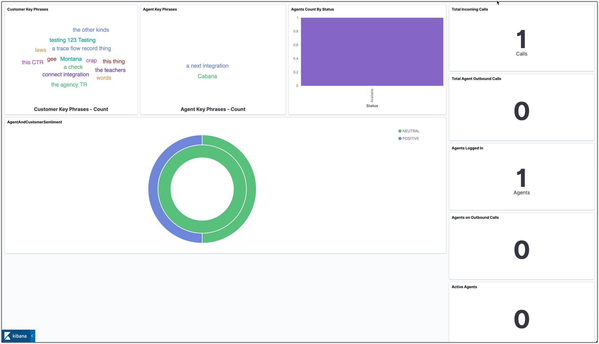
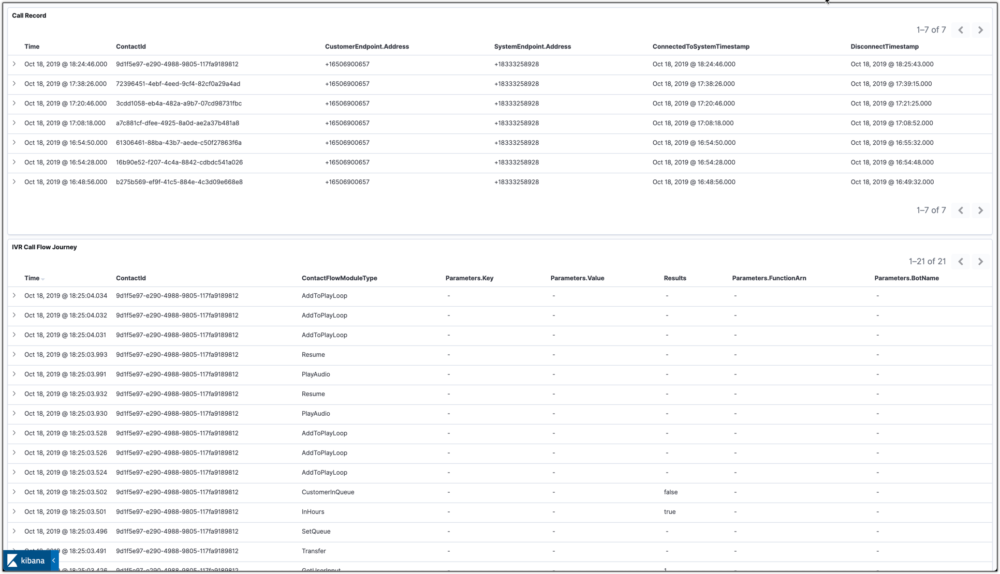
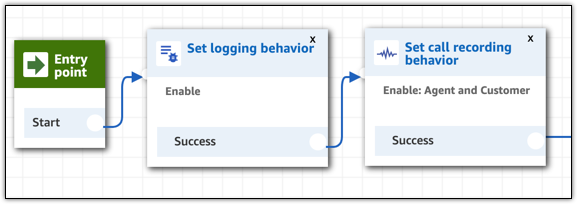
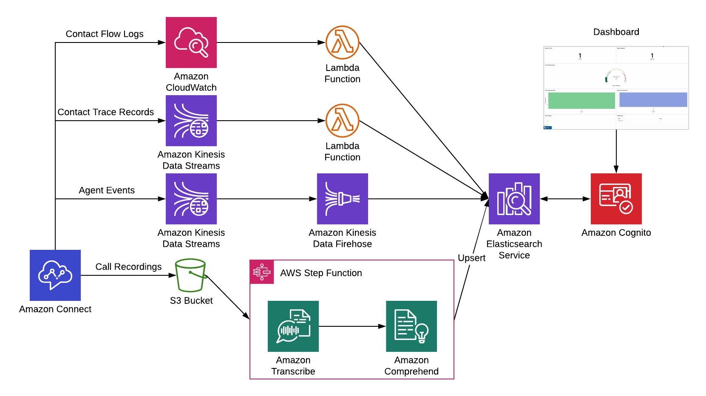
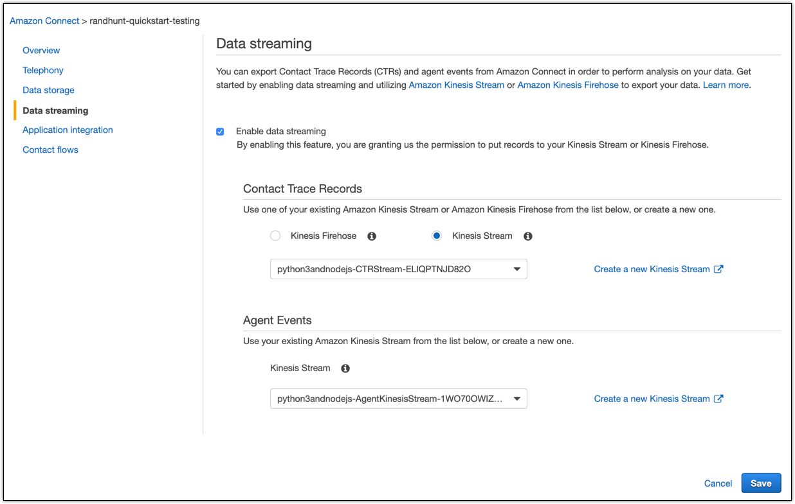
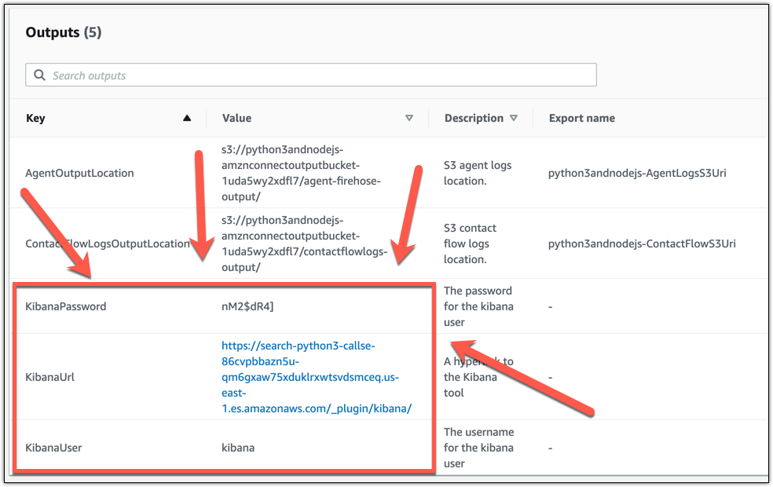
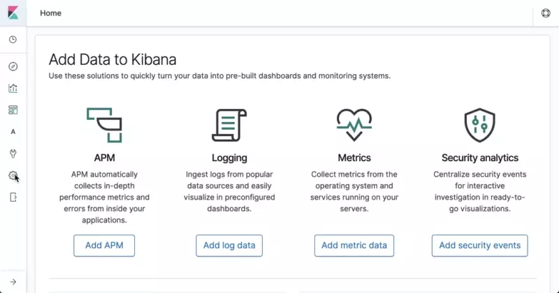

# quickstart-connect-voci

This quickstart automatically provisions an [Amazon Elasticsearch](https://aws.amazon.com/elasticsearch-service/) cluster to ingest [Amazon Connect](https://aws.amazon.com/connect/) CTRs and uses [Amazon Transcribe](https://aws.amazon.com/transcribe/) to transcribe recorded calls then analyzes the resulting transcription with [Amazon Comprehend](https://aws.amazon.com/comprehend/) powered sentiment analysis and key phrase extraction.





## Prerequisites

Launch an Amazon Connect instance, provision a phone number, and create a contact flow that enables recording and logging.



## Architecture



## Directions

1. Build each lambda package by zipping the directory: `./build.sh`
1. Create an S3 bucket with a top level folder and copy all files into it from [GitHub](https://github.com/aws-quickstart/quickstart-connect-voci)

    ```bash
    aws s3 mb s3://my-unique-bucket
    aws s3 sync . s3://my-unique-bucket/ --acl public-read
    ```

2. Create a stack with the template url set to the s3 bucket you just created under `/templates/quickstart-connect-voci-base-pipeline.yaml`
    - The Quick Start S3 bucket and folder should be set to the one that you created in step one
    - The S3 audio bucket will be a new bucket, so add a globally unique name
    - The log group is the log group set for the Amazon Connect instance you want to use. You can see the value in the Amazon Connect AWS Console when viewing the instance details under Contact Flow.
3. Once the stacks deploy, update your Amazon Connect instance to use the new resources created:
    - S3 call recording bucket: the one created by the CF stack
    - Data Streaming CTR: the one created by the stack with "CTRStream" in the name
    - Agent Event Stream: the one created by the stack with "AgentKinesisStream" in the name
    

4. Use the output of the cloudformation template to login to the kibana instance


5. Finally, navigate to the Kibana instance and import the `default_dashboards.json` file here by navigating to settings, saved objects, and clicking import.



## Reference

This solution is based off of two initial solutions:

1) A re:Invent demo that indexed Audio and the CTR into Elastic Search: https://s3.amazonaws.com/serverless-analytics/reinvent-2018-comprehend-transcribe-connect/index.html
2) A blog post that indexed Agent Events and CWL into Elastic Search: https://aws.amazon.com/blogs/contact-center/use-amazon-connect-data-in-real-time-with-elasticsearch-and-kibana/
